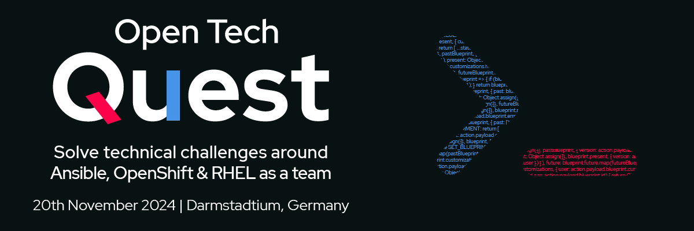

# Red Hat Summit Connect 2024 - Open Tech Quest - OpenShift



## Build on Mac with Podman Destkop

```
export IMAGE="quay.io/openshift-examples/otq-openshift/nginx-example-app:$( date +%s )"

podman build --manifest ${IMAGE} \
    -f nginx-example-app.Containerfile \
    --platform linux/amd64,linux/arm64 .

podman manifest push ${IMAGE}

```